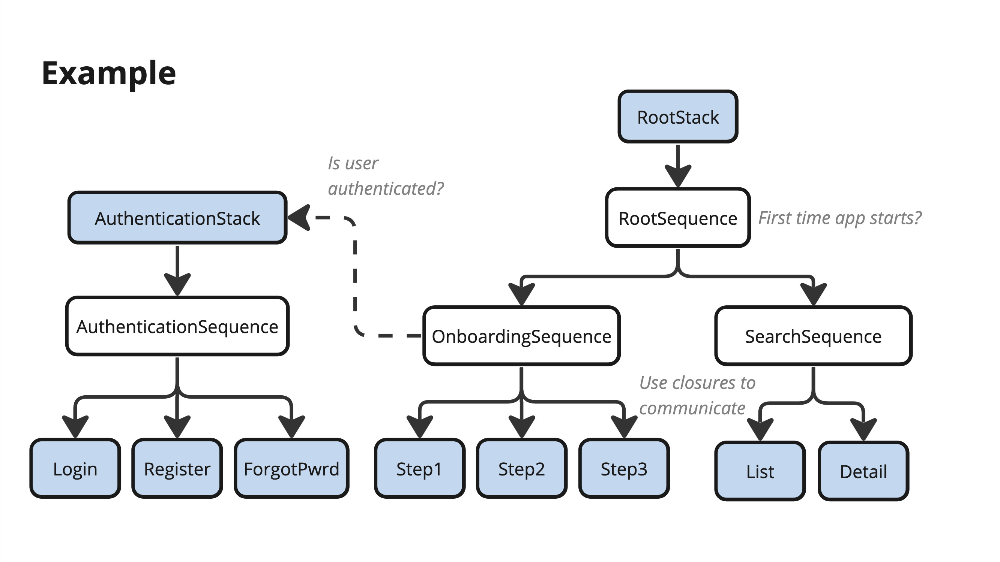

# What is Coordinated Navigation?

Coordinated Navigation is a Swift library that enables **navigating** between screens using a navigation **tree structure** where every node doesn’t need to know each other.

Implemented in SwiftUI (iOS 16 **Navigation Stack**) uses a **Coordinator Pattern** approach.



## Why?

The coordinator pattern establishes who is responsible of navigating in a very clear way.

As a developer I’ve faced many projects where this responsibility is not clear enough.

The Tree Structure forces the coordinators to always be responsible of their **own funnel** and their **direct children**. This helps us to follow the **single responsibility principle**.

## How?

- Using Coordinator Components
   - Stack
   - Sequence
   - Screen
- Composition over inheritance
- Async / Await
- Presentation
- AnyView

### Stack Coordinator
A Stack Coordinator coordinates a navigation stack. It's used as the entry point of the app or a modal presentation.

- Contains a NavigationStack view (Tree structure root).
- Can only set/pop a Sequence.

Example: The root view could be an splash screen. As soon as the app loads some needed stuff, the Stack Coordinator sets the first Sequence Coordinator.

### Sequence Coordinator
A Sequence Coordinator manages the transitions for an specific funnel.
Contains two types of children:

- Sequence Coordinators (tree structure)
- Screen Coordinators (leaf nodes)

Also

- Navigates through a sequence of children nodes
- Can only push/pop/set children nodes

Example: A Sequence (Search funnel) could coordinate between the Suggest / List / Detail screens. Each child doesn't know each other.

### Screen Coordinator

A Screen Coordinator simply represents a SwiftUI view.

- Contains a SwiftUI view (AnyView).
- Leaf node.

Why use a coordinator for a simple screen (view)?

- We avoid the view knowing about Domain scope.
- The coordinator could be in charge of holding a reference to a Presenter or a ViewModel. Or even be used as the ObservableObject.
- Serves as a good abstraction when working with modules/service locators. Clients will know about the existance of a ScreenCoordinator only, but not which view/presentation classes are being used.

## Examples:

Here you can find some examples about how to use the library.

### Creating a Screen using a ScreenCoordinator

Let's start creating a simple SwfitUI view named **ActionsView**. This view is initialized with a title and an array of actions (each one represented by a button). These actions will allow us to make our view call some closures (for example purposes). The view also sets the navigationTitle with the title, this way if we push it into an NavigationStack the navigation title will be shown as well.

```
struct ActionsView: View {

    let title: String
    let actions: [Action]

    struct Action {
        let title: String
        let action: () -> Void
    }

    init(title: String, actions: [Action]) {
        self.title = title
        self.actions = actions
    }

    var body: some View {
        VStack {
            Text(title).font(.title)
            ForEach(actions, id: \.title) { action in
                Button(action: {
                    action.action()
                }, label: {
                    Text(action.title).font(.callout)
                })
            }
        }.navigationTitle(title)
    }
}

``` 

If we want to add our ActionsView into our navigation structure we need to create an ScreenCoordinator that holds the view. An ScreenCoordinator is just a protocol that must be implemented by a class. For simple view initializations we can use the default ScreenCoordinator:

```
let screenCoordinator: ScreenCoordinator = DefaultScreenCoordinator(view: ActionsView(title: "Plain View", actions: []))
```

or

```
let screenCoordinator: ScreenCoordinator = ActionsView(title: "Plain View", actions: []).toScreenCoordinator()
```

But we can also create our custom ScreenCoordinators in case we want a more complex logic / architecture / storage... The ScreenCoordinator protocol conforms to AnyObject so it can also be an ObservableObject if required. For the sake of the example, let's assume we are following an MVVM architecture pattern in our project, and we need to store a ViewModel object outside of the view (maybe for testing purposes we want it to be injected).

Let's update our ActionsView to use a ViewModel (ObservedObject) and then create the custom ScreenCoordinator:

```
struct ActionsView: View {

    struct Action {
        let title: String
        let action: () -> Void
    }

    class ViewModel: ObservableObject {
        
        @Published var title: String
        @Published var actions: [Action]

        init(title: String, actions: [Action]) {
            self.title = title
            self.actions = actions
        }
    }

    @ObservedObject var viewModel: ViewModel

    var body: some View {
        VStack {
            Text(viewModel.title).font(.title)
            ForEach(viewModel.actions, id: \.title) { action in
                Button(action: {
                    action.action()
                }, label: {
                    Text(action.title).font(.callout)
                })
            }
        }.navigationTitle(viewModel.title)
    }
}

class ActionsViewScreenCoordinator: ScreenCoordinator {
    let navigationComponent: ScreenCoordinatorComponent
    let viewModel: ActionsView.ViewModel

    init() {
        // We can perform our complex initialization logic here if needed. Could also be async.
        viewModel = ActionsView.ViewModel(title: "Actions View", actions: [])
        navigationComponent = ScreenCoordinatorComponent(view: ActionsView(viewModel: viewModel))
    }
}
```

## Next Steps?

- [x] Upload an example project.
- [x] Does it makes sense to have a RootView in the Stack? Maybe use an Screen coordinator directly.
- [x] Modal Presentation could also happen from the Stack coordinator.
- [x] Tree structure representation, supporting custom Screen Coordinators.
- [x] Rename Entities to Coordinators.
- [ ] Add a proper how to use README section.
- [ ] Try to use any View instead of AnyView.
- [ ] Explore if I can merge the Stack with the Sequence.
