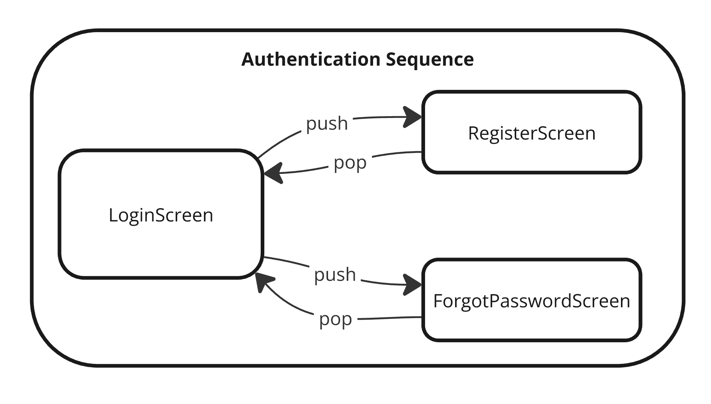

# What is Coordinated Navigation?

Coordinated Navigation is a Swift library that enables **navigating** between screens using a navigation **tree structure** where every node doesn’t need to know each other.

Implemented in SwiftUI (using iOS 16 **Navigation Stack**) following the **Coordinator Pattern** approach.

## Why?

As a developer I've faced many projects where the navigation logic is not structured in a way where navigation funnels can be reused in a flexible way. That's why I came up with a **Tree Structure** solution.


Organizing our navigation into a Tree, where we have branch nodes (sequence coordinators) and leaf nodes (screen coordinators) allows us to isolate funnels with its own transitions, and reuse them wherever we need.

For example let's assume we need an Authentication funnel which consists of showing a Login Screen and then possible navigations (pushes) to a Register Screen or to a Forgotten Password Screen.



Isolating this funnel in an Authentication Sequence coordinator allows us to push this funnel into an existing Navigation Stack (horizontal navigation) and also to present it modally (vertical navigation).

Without this library this specific behaviour is challenging due how SwiftUI works internally, as the horizontal navigation in SwiftUI involves modifyng the NavigationStack's path and the vertical navigation involves adding a sheet or a fullscreen modifier into the current SwiftUI view.

This library allows us to concatenate sequences into our NavigationStack without having to deal with its internal path modifications. Each sequence can be managed by itself and performs its own transitions resulting in a decoupled Tree Structure.

Also, the Tree Structure forces the coordinators to always be responsible of their **own funnel** and their **direct children** only. This helps us to follow the **single responsibility principle** in our navigation.

## How it works?

In order to arrange our views and navigation logic into a tree structure we will use different Coordinator objects. 

- Screen Coordinator
- Sequence Coordinator
- Stack Coordinator

### Screen Coordinator

A Screen Coordinator contains and shows a plain SwiftUI view.

- It's configured using a SwiftUI view. Via init or set.
- In our tree structure is a Leaf node. That means is **NOT** able to push or pop to other screens (NO horizontal navigation).
- It can present other Coordinators modally/fullscreen (vertical navigation).

Benefits of using a coordinator for a simple screen/view?

- We avoid the view struct knowing about Domain scope.
- The same coordinator can set different views (example: one for iPad and one for iPhone).
- Depending of our architecture the coordinator may be in charge of holding a reference to a Presenter or a ViewModel. Or even be used as the ObservableObject for the view.
- Serves as a good abstraction when working with modules. Clients will know about the existance of a ScreenCoordinator only, but not which view/presentation classes are being used inside.

### Sequence Coordinator

A Sequence Coordinator is just a piece of logic that manages navigation between different Screens or Sequences in a horizontal navigation. It can **PUSH, POP or SET** two types of coordinators:

- Sequence Coordinators (branch nodes)
- Screen Coordinators (leaf nodes)

When a coordinator is pushed or setted, it's added as a child coordinator of the Sequence. As a Sequence Coordinator can add other Sequence Coordinators, this ends up creating the tree structure. Sequence Coordinators can update their own children whenever is required (push, pop or set) and the navigation tree will be updated automatically.

### Stack Coordinator
A Stack Coordinator shows a NavigationStack view (horizontal navigation).

- It's used as the entry point of the app or a modal presentation.
- Can only **SET or POP** a Sequence.

In order to show the content of the tree structure a Sequence Coordinator (root of the tree) must be setted into an Stack Coordinator. This will unwrap the tree content inside a NavigationStack view. It will show all the pushed Screen Coordinators (leaf nodes) as if we perform a **Depth-first search** in the tree. It will animate the changes automatically (same as if we were using a NavigationStack or a UINavigationController but respecting the current tree structure).

## How to use:

Here you can find some examples about how to use the library.

### Creating a simple Screen Coordinator

Let's start creating a simple SwfitUI view named **TitleView**. This view receives a title string and sets a Text in the middle of the screen and also sets the navigationTitle, this way if we use it into an Stack the navigation title will be shown as well.

```
import SwiftUI
import CoordinatedNavigation

struct TitleView: View {

    let title: String

    init(title: String) {
        self.title = title
    }

    var body: some View {
        Text(title)
            .navigationTitle(title)
    }
}
```

Now that we have a TitleView, as an example, let's create one with the title "Splash Screen". Let's create its own Screen Coordinator using one of the next approaches:

```
// 1. Using the default screen coordinator.
let screenCoordinator: ScreenCoordinator = DefaultScreenCoordinator(view: TitleView(title: "Splash Screen"))

// 2. Using the default screen coordinator sugar method.
let screenCoordinator: ScreenCoordinator = TitleView(title: "Splash Screen").toScreenCoordinator()

// 3. Creating a custom screen coordinator in case we want a more complex lifecycle.
class SplashScreenCoordinator: ScreenCoordinator {
    let navigationComponent = ScreenCoordinatorComponent()

    init() {
        navigationComponent.setView(TitleView(title: "Splash Screen"))
    }
}

let screenCoordinator: ScreenCoordinator = SplashScreenCoordinator()
```

### Creating a Sequence Coordinator

Let's create the previous example Authentication Sequence. The Sequence will start showing a Login Screen and then, from this screen, the user can navigate to a Register Screen or to a Forgot Password Screen.

First, we create the Login View (Login screen).

`TODO: Login View Code`

Then we create the Register view (Register screen) and the Forgot Password view (Forgot Password screen).

`TODO: Register View & Forgot Password View Code`

Now let's create the Sequence that defines the navigation between them. The library is really flexible so we can create it using two different approaches:

1: Using the Default Sequence Coordinator class.

`TODO: Sequence Coordinator Code`

2: Creating a Custom Sequence Coordinator class.

`TODO: Sequence Coordinator Code`


### Creating a more complex custom ScreenCoordinator

Let's start creating a simple SwfitUI view named **ActionsView**. This view is initialized with a title and an array of actions (each one represented by a button). These actions will allow us to make our view call some closures (for example purposes). The view also sets the navigationTitle with the title, this way if we push it into an NavigationStack the navigation title will be shown as well.

```
struct ActionsView: View {

    let title: String
    let actions: [Action]

    struct Action {
        let title: String
        let action: () -> Void
    }

    init(title: String, actions: [Action]) {
        self.title = title
        self.actions = actions
    }

    var body: some View {
        VStack {
            Text(title).font(.title)
            ForEach(actions, id: \.title) { action in
                Button(action: {
                    action.action()
                }, label: {
                    Text(action.title).font(.callout)
                })
            }
        }.navigationTitle(title)
    }
}

``` 

If we want to add our ActionsView into our navigation structure we need to create an ScreenCoordinator that holds the view. An ScreenCoordinator is just a protocol that must be implemented by a class. For simple view initializations we can use the default ScreenCoordinator:

```
let screenCoordinator: ScreenCoordinator = DefaultScreenCoordinator(view: ActionsView(title: "Plain View", actions: []))
```

or

```
let screenCoordinator: ScreenCoordinator = ActionsView(title: "Plain View", actions: []).toScreenCoordinator()
```

But we can also create our custom ScreenCoordinators in case we want a more complex logic / architecture / storage... The ScreenCoordinator protocol conforms to AnyObject so it can also be an ObservableObject if required. For the sake of the example, let's assume we are following an MVVM architecture pattern in our project, and we need to store a ViewModel object outside of the view (maybe for testing purposes we want it to be injected).

Let's update our ActionsView to use a ViewModel (ObservedObject) and then create the custom ScreenCoordinator:

```
struct ActionsView: View {

    struct Action {
        let title: String
        let action: () -> Void
    }

    class ViewModel: ObservableObject {
        
        @Published var title: String
        @Published var actions: [Action]

        init(title: String, actions: [Action]) {
            self.title = title
            self.actions = actions
        }
    }

    @ObservedObject var viewModel: ViewModel

    var body: some View {
        VStack {
            Text(viewModel.title).font(.title)
            ForEach(viewModel.actions, id: \.title) { action in
                Button(action: {
                    action.action()
                }, label: {
                    Text(action.title).font(.callout)
                })
            }
        }.navigationTitle(viewModel.title)
    }
}

class ActionsViewScreenCoordinator: ScreenCoordinator {
    let navigationComponent: ScreenCoordinatorComponent
    let viewModel: ActionsView.ViewModel

    init() {
        // We can perform our complex initialization logic here if needed. Could also be async.
        viewModel = ActionsView.ViewModel(title: "Actions View", actions: [])
        navigationComponent = ScreenCoordinatorComponent(view: ActionsView(viewModel: viewModel))
    }
}
```

## Using

- Composition over inheritance
- Async / Await
- Presentation
- AnyView

## Next Steps?

- [x] Upload an example project.
- [x] Does it makes sense to have a RootView in the Stack? Maybe use an Screen coordinator directly.
- [x] Modal Presentation could also happen from the Stack coordinator.
- [x] Tree structure representation, supporting custom Screen Coordinators.
- [x] Rename Entities to Coordinators.
- [ ] Add a proper how to use README section.
- [ ] Try to use any View instead of AnyView.
- [ ] Search a better naming for the Screen and ScreenCoordinator.
- [ ] Explore if I can merge the Stack with the Sequence.
